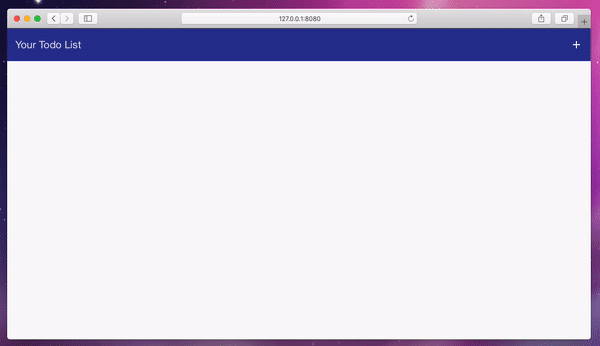

# angular-todo
A simple angular 1.x todo list.

The main goal for this project was to develop a small angular app that properly followed the [Angular 1 Style Guide](https://github.com/johnpapa/angular-styleguide/blob/master/a1/README.md). 

